# LifeUp Platform - User Flow Diagram

## Complete User Journey & System Process

```mermaid
graph TD
    Start(["👤 User Starts<br/>LifeUp App"]) --> InputChoice{{"Input Type?"}}
    
    InputChoice -->|Voice| VoiceInput["🎤<br/>Voice Input<br/>Web Speech API"]
    InputChoice -->|Text| TextInput["⌨️<br/>Text Input<br/>User Types"]
    
    VoiceInput --> STT["📝<br/>Speech-to-Text<br/>Transcription"]
    TextInput --> Preprocess["🔄<br/>Preprocessing<br/>Clean & Format"]
    STT --> Preprocess
    
    Preprocess --> QueryEmbed["🧮<br/>Generate Query<br/>Embedding Vector"]
    
    QueryEmbed --> VectorSearch["🔍<br/>Vector Search<br/>Query PgVector"]
    
    VectorSearch --> MetaRetrieval["📚<br/>Retrieve Metadata<br/>From PostgreSQL"]
    
    VectorSearch --> ContextCheck{{"Context<br/>Retrieved?"}}
    ContextCheck -->|Yes| Assembly["🛠️<br/>Assemble Context<br/>Combine Information"]
    ContextCheck -->|No| DefaultContext["⚠️<br/>Use Default<br/>Context"]
    DefaultContext --> Assembly
    
    MetaRetrieval --> Assembly
    
    Assembly --> LLMCall["🤖<br/>Call LLM Model<br/>Generate Response"]
    
    LLMCall --> Summarize["📄<br/>Smart Summarization<br/>Create Summary"]
    
    Summarize --> Response{{"Response<br/>Type?"}}
    
    Response -->|Chatbot| ChatReturn["💬<br/>Return AI Response<br/>to User"]
    Response -->|Summary| SummaryReturn["📋<br/>Return Summary<br/>to Dashboard"]
    
    ChatReturn --> StoreData["💾<br/>Store Embedding<br/>& Metadata"]
    SummaryReturn --> StoreData
    
    StoreData --> UpdateDB["🗄️<br/>Update PostgreSQL<br/>& PgVector"]
    
    UpdateDB --> DisplayDash["📊<br/>Display on<br/>Dashboard"]
    
    DisplayDash --> UserChoice{{"User<br/>Action?"}}
    
    UserChoice -->|Continue Chat| InputChoice
    UserChoice -->|Log Activity| LogActivity["🏃<br/>Log Wellness<br/>Activity"]
    UserChoice -->|Visit Forum| Forum["👥<br/>Browse Community<br/>Forum"]
    UserChoice -->|Exit| End(["✓ Session End"])
    
    LogActivity --> DisplayDash
    Forum --> DisplayDash
    
    style Start fill:#333,stroke:#000,stroke-width:3px,color:#fff
    style End fill:#333,stroke:#000,stroke-width:3px,color:#fff
    style InputChoice fill:#555,stroke:#000,stroke-width:2px,color:#fff
    style ContextCheck fill:#555,stroke:#000,stroke-width:2px,color:#fff
    style Response fill:#555,stroke:#000,stroke-width:2px,color:#fff
    style UserChoice fill:#555,stroke:#000,stroke-width:2px,color:#fff
    
    style VoiceInput fill:#444,stroke:#000,stroke-width:2px,color:#fff
    style TextInput fill:#444,stroke:#000,stroke-width:2px,color:#fff
    style STT fill:#444,stroke:#000,stroke-width:2px,color:#fff
    style Preprocess fill:#444,stroke:#000,stroke-width:2px,color:#fff
    style QueryEmbed fill:#444,stroke:#000,stroke-width:2px,color:#fff
    style VectorSearch fill:#444,stroke:#000,stroke-width:2px,color:#fff
    style MetaRetrieval fill:#444,stroke:#000,stroke-width:2px,color:#fff
    style Assembly fill:#444,stroke:#000,stroke-width:2px,color:#fff
    style DefaultContext fill:#444,stroke:#000,stroke-width:2px,color:#fff
    style LLMCall fill:#444,stroke:#000,stroke-width:2px,color:#fff
    style Summarize fill:#444,stroke:#000,stroke-width:2px,color:#fff
    style ChatReturn fill:#444,stroke:#000,stroke-width:2px,color:#fff
    style SummaryReturn fill:#444,stroke:#000,stroke-width:2px,color:#fff
    style StoreData fill:#444,stroke:#000,stroke-width:2px,color:#fff
    style UpdateDB fill:#444,stroke:#000,stroke-width:2px,color:#fff
    style DisplayDash fill:#444,stroke:#000,stroke-width:2px,color:#fff
    style LogActivity fill:#444,stroke:#000,stroke-width:2px,color:#fff
    style Forum fill:#444,stroke:#000,stroke-width:2px,color:#fff
```

## Legend

- **Ovals**: Start and End points
- **Rectangles**: Processing steps and actions
- **Diamonds**: Decision points
- **Black Theme**: Simple, professional appearance
