# Serene — System Flow Diagram

## Complete User Journey & System Architecture

```mermaid
graph TD
    Start(["👤 User Opens<br/>Serene App"]) --> Auth{{"User Exists?"}}

    Auth -->|No| CreateUser["🆕<br/>Auto-Create User<br/>POST /api/v1/user/{username}"]
    Auth -->|Yes| LoadDashboard["🏠<br/>Load Dashboard<br/>home.jsx"]
    CreateUser --> LoadDashboard

    LoadDashboard --> FetchAll["📡<br/>Hydrate State<br/>Parallel API Calls"]

    FetchAll --> FetchPlan["📋<br/>GET /daily/{user}/plan<br/>Merged Task Schedule"]
    FetchAll --> FetchUser["👤<br/>GET /user/{user}<br/>XP + Level"]
    FetchAll --> FetchStats["📊<br/>GET /stats/mental/{user}<br/>Session History"]

    FetchPlan --> MergeSources["🔀<br/>Merge Task Sources<br/>task_service.get_tasks()"]
    MergeSources --> DefaultTasks["⚡<br/>DEFAULT Tasks<br/>SQLite DB"]
    MergeSources --> AiTasks["🤖<br/>AI Tasks<br/>SQLite DB"]
    MergeSources --> CustomTasks["✏️<br/>CUSTOM Tasks<br/>JSON File"]

    DefaultTasks & AiTasks & CustomTasks --> RenderTabs["🎨<br/>Render Dashboard<br/>Focus / Log / Stats Tabs"]
    FetchUser --> RenderTabs
    FetchStats --> RenderTabs

    RenderTabs --> TabChoice{{"Active Tab?"}}

    TabChoice -->|Focus| FocusTab["🎯<br/>Active Quest View<br/>Next Scheduled Task"]
    TabChoice -->|Log| LogTab["📅<br/>Daily Schedule<br/>All Tasks + Statuses"]
    TabChoice -->|Stats| StatsTab["📈<br/>Mental Health Stats<br/>Energy & Progress"]
    TabChoice -->|Chat| ChatFlow["💬<br/>Open Serene Chat<br/>Start / Resume Session"]

    %% Focus Tab
    FocusTab --> ExecuteBtn["▶️<br/>Start Task Button<br/>POST /daily/{user}/execute"]
    ExecuteBtn --> CompleteBtn["✅<br/>Complete Task<br/>POST /daily/{user}/complete"]
    CompleteBtn --> XpCalc["⚙️<br/>Calc XP<br/>Timing + Duration Bonus"]
    XpCalc --> UpdateXP["💎<br/>Update User XP<br/>SQLite users table"]
    UpdateXP --> LevelUp{{"Level Up?"}}
    LevelUp -->|Yes| ShowLevelUp["🎉<br/>Level Up Toast<br/>New Level Displayed"]
    LevelUp -->|No| RefreshFocus["🔄<br/>Refresh Focus View"]
    ShowLevelUp --> RefreshFocus

    %% Log Tab — Task Management
    LogTab --> TaskAction{{"Task Action?"}}
    TaskAction -->|Add Custom| AddTaskModal["📝<br/>Task Form Modal<br/>activity, time, xp"]
    AddTaskModal --> PostTask["💾<br/>POST /tasks/{user}/manual<br/>DB + JSON Write"]
    PostTask --> RefreshLog["🔄<br/>Refresh Plan<br/>GET /daily/{user}/plan"]

    TaskAction -->|Edit Custom| EditModal["✏️<br/>Edit Task Modal<br/>Custom Only"]
    EditModal --> PutTask["🔁<br/>PUT /tasks/{user}/manual/{time}<br/>DB + JSON Update"]
    PutTask --> RefreshLog

    TaskAction -->|Delete Custom| DelTask["🗑️<br/>DELETE /tasks/{user}/manual/{time}<br/>DB + JSON Remove"]
    DelTask --> RefreshLog
    RefreshLog --> LogTab

    %% Chat Flow
    ChatFlow --> InputType{{"Input Type?"}}
    InputType -->|Text| TextMsg["⌨️<br/>Text Message<br/>User Types"]
    InputType -->|Voice| VoiceMsg["🎤<br/>Voice Message<br/>MediaRecorder API"]
    VoiceMsg --> UploadAudio["☁️<br/>Upload Audio<br/>POST /sessions/{user}/{id}/voice"]
    UploadAudio --> SereneCall
    TextMsg --> SereneCall["🤖<br/>Serene AI Call<br/>POST /sessions/{user}/{id}/chat"]

    SereneCall --> GeminiChat["✨<br/>Gemini 2.0 Flash<br/>oracle_service.py"]
    GeminiChat --> SessionFile["💾<br/>Append to Session<br/>local_data/session/*.json"]
    SessionFile --> StreamReply["💬<br/>Serene Reply<br/>Structured JSON Response"]
    StreamReply --> UserChoice{{"User Action?"}}

    UserChoice -->|Continue| InputType
    UserChoice -->|End Session| EndSession["🔚<br/>POST /sessions/{user}/{id}/end<br/>Close Session File"]

    EndSession --> Analyze["🔬<br/>POST /sessions/{user}/{id}/analyze<br/>Trigger Analysis"]
    Analyze --> GeminiAnalysis["🧠<br/>Gemini Analysis<br/>analysis_service.py"]
    GeminiAnalysis --> ParseResult["📊<br/>Parse JSON Result<br/>Feelings, Energy, Tasks"]
    ParseResult --> SaveAnalysis["💾<br/>Save to ConversationAnalysis<br/>SQLite DB"]
    ParseResult --> ReplaceAiTasks["♻️<br/>replace_ai_tasks()<br/>Atomic Swap in DB"]
    SaveAnalysis & ReplaceAiTasks --> RefreshAll["🔄<br/>Refresh Dashboard<br/>New AI Tasks Visible"]
    RefreshAll --> RenderTabs

    style Start fill:#222,stroke:#000,stroke-width:3px,color:#fff
    style Auth fill:#444,stroke:#000,stroke-width:2px,color:#fff
    style TabChoice fill:#444,stroke:#000,stroke-width:2px,color:#fff
    style LevelUp fill:#444,stroke:#000,stroke-width:2px,color:#fff
    style TaskAction fill:#444,stroke:#000,stroke-width:2px,color:#fff
    style InputType fill:#444,stroke:#000,stroke-width:2px,color:#fff
    style UserChoice fill:#444,stroke:#000,stroke-width:2px,color:#fff

    style CreateUser fill:#333,stroke:#000,stroke-width:2px,color:#fff
    style LoadDashboard fill:#333,stroke:#000,stroke-width:2px,color:#fff
    style FetchAll fill:#333,stroke:#000,stroke-width:2px,color:#fff
    style FetchPlan fill:#333,stroke:#000,stroke-width:2px,color:#fff
    style FetchUser fill:#333,stroke:#000,stroke-width:2px,color:#fff
    style FetchStats fill:#333,stroke:#000,stroke-width:2px,color:#fff
    style MergeSources fill:#333,stroke:#000,stroke-width:2px,color:#fff
    style DefaultTasks fill:#333,stroke:#000,stroke-width:2px,color:#fff
    style AiTasks fill:#333,stroke:#000,stroke-width:2px,color:#fff
    style CustomTasks fill:#333,stroke:#000,stroke-width:2px,color:#fff
    style RenderTabs fill:#333,stroke:#000,stroke-width:2px,color:#fff
    style FocusTab fill:#333,stroke:#000,stroke-width:2px,color:#fff
    style LogTab fill:#333,stroke:#000,stroke-width:2px,color:#fff
    style StatsTab fill:#333,stroke:#000,stroke-width:2px,color:#fff
    style ChatFlow fill:#333,stroke:#000,stroke-width:2px,color:#fff
    style ExecuteBtn fill:#333,stroke:#000,stroke-width:2px,color:#fff
    style CompleteBtn fill:#333,stroke:#000,stroke-width:2px,color:#fff
    style XpCalc fill:#333,stroke:#000,stroke-width:2px,color:#fff
    style UpdateXP fill:#333,stroke:#000,stroke-width:2px,color:#fff
    style ShowLevelUp fill:#333,stroke:#000,stroke-width:2px,color:#fff
    style RefreshFocus fill:#333,stroke:#000,stroke-width:2px,color:#fff
    style AddTaskModal fill:#333,stroke:#000,stroke-width:2px,color:#fff
    style PostTask fill:#333,stroke:#000,stroke-width:2px,color:#fff
    style EditModal fill:#333,stroke:#000,stroke-width:2px,color:#fff
    style PutTask fill:#333,stroke:#000,stroke-width:2px,color:#fff
    style DelTask fill:#333,stroke:#000,stroke-width:2px,color:#fff
    style RefreshLog fill:#333,stroke:#000,stroke-width:2px,color:#fff
    style TextMsg fill:#333,stroke:#000,stroke-width:2px,color:#fff
    style VoiceMsg fill:#333,stroke:#000,stroke-width:2px,color:#fff
    style UploadAudio fill:#333,stroke:#000,stroke-width:2px,color:#fff
    style SereneCall fill:#333,stroke:#000,stroke-width:2px,color:#fff
    style GeminiChat fill:#333,stroke:#000,stroke-width:2px,color:#fff
    style SessionFile fill:#333,stroke:#000,stroke-width:2px,color:#fff
    style StreamReply fill:#333,stroke:#000,stroke-width:2px,color:#fff
    style EndSession fill:#333,stroke:#000,stroke-width:2px,color:#fff
    style Analyze fill:#333,stroke:#000,stroke-width:2px,color:#fff
    style GeminiAnalysis fill:#333,stroke:#000,stroke-width:2px,color:#fff
    style ParseResult fill:#333,stroke:#000,stroke-width:2px,color:#fff
    style SaveAnalysis fill:#333,stroke:#000,stroke-width:2px,color:#fff
    style ReplaceAiTasks fill:#333,stroke:#000,stroke-width:2px,color:#fff
    style RefreshAll fill:#333,stroke:#000,stroke-width:2px,color:#fff
```

## Legend

- **Ovals**: Start and End points
- **Rectangles**: Processing steps and actions  
- **Diamonds**: Decision points
- **Black Theme**: Consistent with LifeUp Flowchart Classic style

## Task Source Key

| Badge | Source | Storage | Editable? |
|-------|--------|---------|-----------|
| ⚡ DEFAULT | Constitution tasks seeded at app creation | SQLite DB | ❌ No |
| 🤖 AI | Generated by Serene after each session analysis | SQLite DB (replaced each session) | ❌ No |
| ✏️ CUSTOM | Created by the user | SQLite DB + `local_data/custom_tasks/{user}.json` | ✅ Yes |

