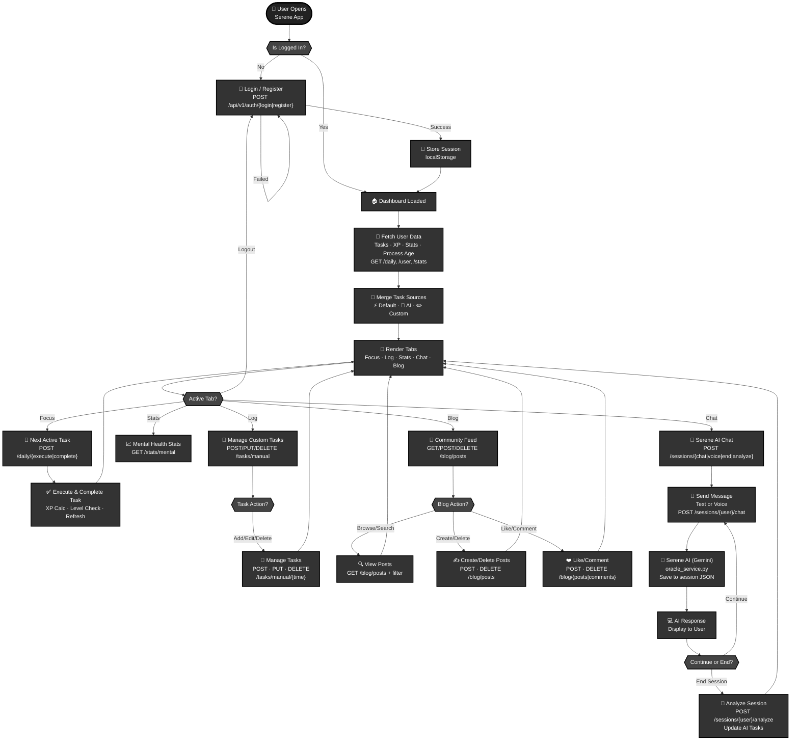

# Serene — System Flow Diagram (Simplified)

## High-Level User Journey & System Architecture

## Legend

- **Ovals**: Start/End points
- **Rectangles**: Operations (API calls + UI actions)
- **Diamonds**: Decision points
- **Merged Operations**: POST, PUT, DELETE combined into single nodes for clarity

## System Components

| Component | Purpose |
|-----------|---------|
| **Auth** | Login/Register — bcrypt hashing + localStorage session |
| **Dashboard** | Parallel data fetch + merge task sources |
| **Focus Tab** | Execute & complete active task → XP calculation |
| **Log Tab** | Create/Edit/Delete custom tasks |
| **Stats Tab** | Mental health metrics + energy tracking |
| **Chat Tab** | Serene AI (Gemini) + session analysis → AI task generation |
| **Blog Tab** | Community feed with posts, likes, comments |

## API Reference (Simplified)

| Feature | Method | Endpoint | Purpose |
|---------|--------|----------|---------|
| **Auth** | POST | `/api/v1/auth/{login\|register}` | Authenticate user |
| **Logout** | POST | `/api/v1/auth/logout` | Clear session |
| **Tasks** | GET/POST/PUT/DELETE | `/daily`, `/stats`, `/tasks/manual` | Fetch & manage tasks |
| **Blog** | GET/POST/DELETE | `/api/v1/blog/posts\|comments` | Posts + interactions |
| **Chat** | POST | `/sessions/{user}/{chat\|voice\|end\|analyze}` | AI chat + analysis |
---